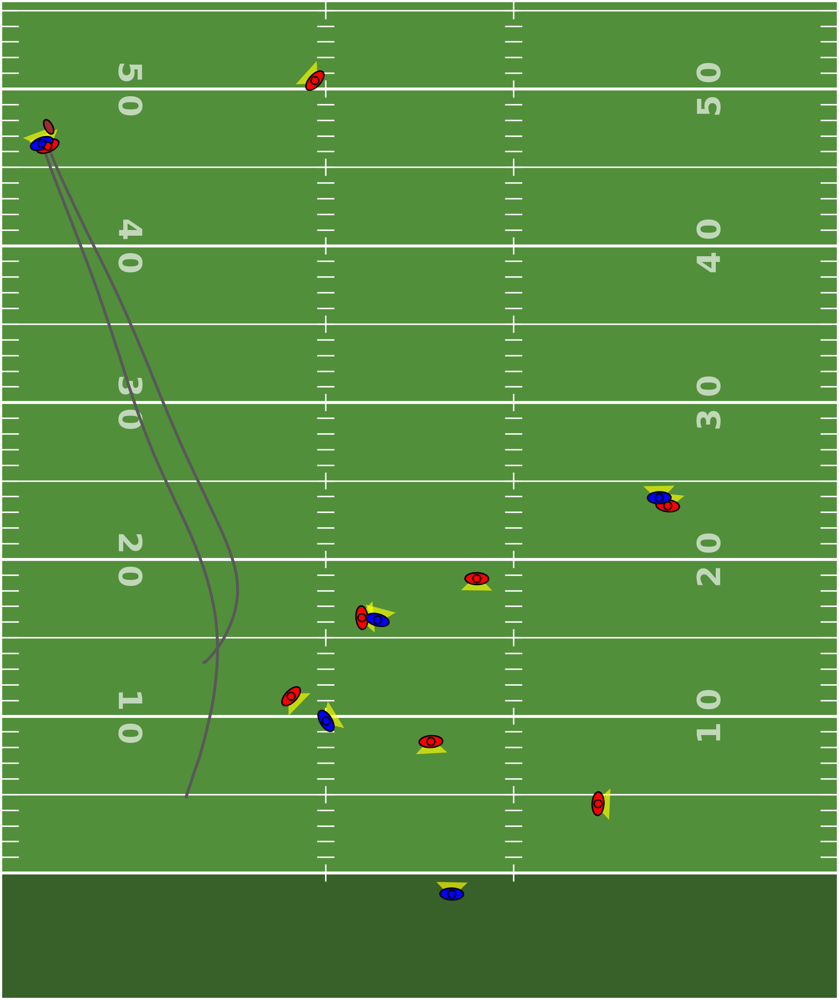

# Speed Matters: How Defender 40 Times Impact Pass Defense

## Introduction

The NFL Combine is where the league's top prospects put their athleticism on display, showcasing their speed, agility, and strength. One of the most iconic tests is the 40-yard dash, a baseline measure of a player's straight-line speed and acceleration. But how much does this actually matter once players hit the field? 

In this analysis, we examine how a defender's 40-yard dash time influences their ability to close on the ball during pass plays and how teams can use these insights to sharpen their play calling. 

## Data Sources 

### Player Tracking Data 

Through the NFL Big Data Bowl, we were provided player tracking data from the 2023 NFL season. This included frame-by-frame position data for receivers and defenders on pass plays before the pass and while the ball was in the air. It also included supplementary info about each play such as the pass result, route of the targeted receiver, and defensive coverage type. 

These are a few terms we'll use with the tracking data: 

- Final frame - last frame in the dataset, signifying when the ball is caught, falls incomplete, or gets intercepted 
- Ball landing position - position of the ball at the final frame (so if the ball is caught, this is actually the spot of the catch)
- Primary defender - defender that's closest to the targeted receiver at the final frame 

### Defender 40-Times 

We pulled NFL Combine results from this [Pro Football Reference](https://www.pro-football-reference.com/) website to get the 40 times for each defender. Note that this only uses 40 times from the NFL Combine, so we don't have data for defenders who didn't run the 40-Yard Dash in the Combine, and they were excluded from the analysis. 

## Defender Tracking Metrics 

Using the tracking data, we developed 3 different metrics to measure the defender's movement throughout the play: 

1. Top Speed - max speed of the defender throughout the play 
    - This includes both before the ball is thrown and while the ball is in the air 
    - Measured in miles per hour (mph)
2. Peak Acceleration to the Ball - max acceleration towards the ball landing position 
    - We calculated this using distance between the defender's position at each frame and the ball landing position (so that it takes into account the defender's ability to change direction to move towards the ball) 
    - This is measured in yards per second squared (yd/s²) 
3. Final Separation - distance between the receiver and primary defender at the final frame 
    - Measured in yards 

We picked out a few play examples below to demonstrate these metrics: 

### Example 1. DJ Turner vs Go Route 

In the first example, we see DJ Turner (who set the record for the 2023 Combine with a 4.26) having to turn and run with the receiver on a go route (allowing only ___ yards of separation by the time the ball gets there): 

*Figure 1: DJ Turner coverage on go route* 

When we plot out his speed throughout the play, we see that he hit a top speed of 22 mph (which is actually faster than the receiver), allowing him to catch up to the receiver and prevent a big play. 

(Figure 2: example 1 chart) 

### Example 2. Deonte Banks vs Out Route 

In our second example, the receiver runs a deep out in the end zone, forcing Deonte Banks to shift from a slight backpedal to a sprint towards the sideline: 

(Figure 3: example 2 play) 

When we plot out his acceleration to the ball, we see that it peaks at 7.5 yd/s² - allowing him to catch up to the receiver (with only __ yards of final separation), get out in front, and prevent the touchdown. 

(figure 4: example 2 chart)

## High-Impact Setups 

While defender speed had a big impact on the examples above, this isn't always the case. There are a lot of factors that go into whether or not a pass is completed, so speed alone doesn't always have a significant impact. Thus, we created a simple ML model to estimate the actual impact of defender speed on pass plays. 

### ML Model 

We built a model that predicts whether or not a pass will be completed based on 3 simple factors: 

- The 40 time of the primary defender 
- The route of the targeted receiver 
- The defensive coverage type 

Note that we used an XGBoost tree model where the first 13 weeks of the season were used to train the model (i.e. "training dataset") and the last 5 weeks were used to evaluate model accuracy (i.e. "test dataset"). 

### SHAP Values 

We used a tool called SHAP values to measure the effect that defender 40 time has on each prediction. We can calculate a SHAP value for each of our 3 predictor variables (on a specific play) that tells us how influential each variable is on the completion probability. 

We won't go into too much detail about SHAP values, but there are 2 main guidelines for how to interpret the 40 time impact on a given play: 

1. A value of 0 means no impact 
2. Negative values mean the defender speed decreased completion probability (lower values mean bigger impact)
3. Positive values mean the defender speed increased completion probability (higher values mean bigger impact) 

### High-Impact Classification 

To simplify our analysis, we decided to flag "high-impact" plays where the defender's 40 time has a significantly negative impact on the pass result. We classify a "significantly low" impact as anything with a SHAP value below -0.1. 

For example, in the play below (see Figure 5), we see a go route planned against a cover 3 zone defense. This route is setup to be covered by Eric Stokes, who ran a 4.31 in the 2021 NFL Comine. 

Against a normal defender (i.e. average 40 time), we estimate a 42.8% completion probability for this route. However, against Stokes, the completion probability drops down to 29.4%. 

(Figure 5: play prediction)

In an actual game scenario, we could setup this model to evaluate the play setup in real-time, send alerts for when high-impact setups occur, and prompt the players/coaches to adjust the play design to avoid the elite defender. 

## Overall Trends 

In addition to flagging setups in real-time, we can look at a few overall trends to analyze the general impact of defender speed. To start, we'll combine our "high-impact" classification with the defender tracking metrics from before. 

Overall (in the test dataset), we found that in high-impact plays, defenders 

- Move at a **5.3% higher top speed** (13.5 mph vs 12.8 mph) 
- Allow **15.8% less separation** (2.7 yards vs 3.21 yards) 
- Give up a **9.0% lower completion rate** (61.1% vs 67.1%) 

Note that we didn't actually see a significant difference in acceleration (5.0 yd/s² vs 4.97 yd/s²). We believe this is because a lot of the high-impact plays occur on deeper routes (see Table 1 below) where the defender is already running in the right direction when the ball is thrown. 

### Breakout by Route 

To see which routes are most impacted by defender speed, we summarized the high-impact plays across the different route types: 

(Table 1: high-impact plays by route) 

We see that defender speed has the highest impact on Go routes, where they typically have to turn and run with the receiver. 

### Breakout by Coverage 

We also broke it out accross the different defensive coverage types to see which coverage schemes are most impacted by defender speed: 

(Table 2: high-impact plays by coverage type)

We see that defender speed is typically more important in man coverage compared to zone coverage. However, it was actually most influential in a cover 3 zone (where the back 3 defenders have to cover a lot of vertical space).  

## Conclusion

At the end of the day, the 40-yard dash is more than just a combine headline — it can have a huge impact on the right play. While defender speed is just one of many factors, we used Data Science to identify scenarios where it's most important and compared it to in-game speed metrics from player tracking data. 

By building a predictive model and identifying "high-impact" setups, we've created a framework that allows teams to:

1. **Evaluate matchups in real-time** — Identifying when an elite defender's speed gives them a significant advantage
2. **Adjust play calling** — Modifying route designs or targeting decisions when facing high-impact matchups
3. **Optimize game planning** — Understanding which routes and coverages are most vulnerable to elite defender speed 

This approach transforms combine metrics from simple scouting data into actionable intelligence that can influence in-game decision making. As tracking data continues to improve and the analytics become more sophisticated, it's insights like these that'll help teams survive and thrive in the modern NFL. 

## Appendix: Code

The code for the analysis and visuals is available in a public [GitHub repo](https://github.com/rjf2022/nfl-big-data-bowl/tree/main/Final%20Code). The code is broken out across a few different Jupyter notebooks: 

1. [Summarize Tracking Data](https://github.com/rjf2022/nfl-big-data-bowl/blob/main/Final%20Code/1.%20Summarize%20Tracking%20Data.ipynb)
2. [Pull Combine Data](https://github.com/rjf2022/nfl-big-data-bowl/blob/main/Final%20Code/2.%20Pull%20Combine%20Data.ipynb) 
3. [Analyze Metrics](https://github.com/rjf2022/nfl-big-data-bowl/blob/main/Final%20Code/3.%20Analyze%20Metrics.ipynb) 
4. [Create Visuals](https://github.com/rjf2022/nfl-big-data-bowl/blob/main/Final%20Code/4.%20Create%20Visuals.ipynb)

## Acknowledgments

This analysis was conducted as part of the 2026 NFL Big Data Bowl using player tracking data provided by the NFL. Special thanks to the NFL for making this rich dataset available to the analytics community.

Michael Lopez, Tom Bliss, Ally Blake, and Addison Howard. NFL Big Data Bowl 2026 - Analytics. https://kaggle.com/competitions/nfl-big-data-bowl-2026-analytics, 2025. Kaggle.
